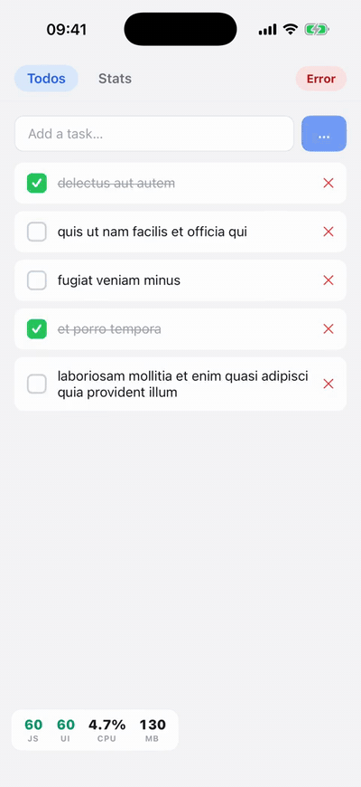
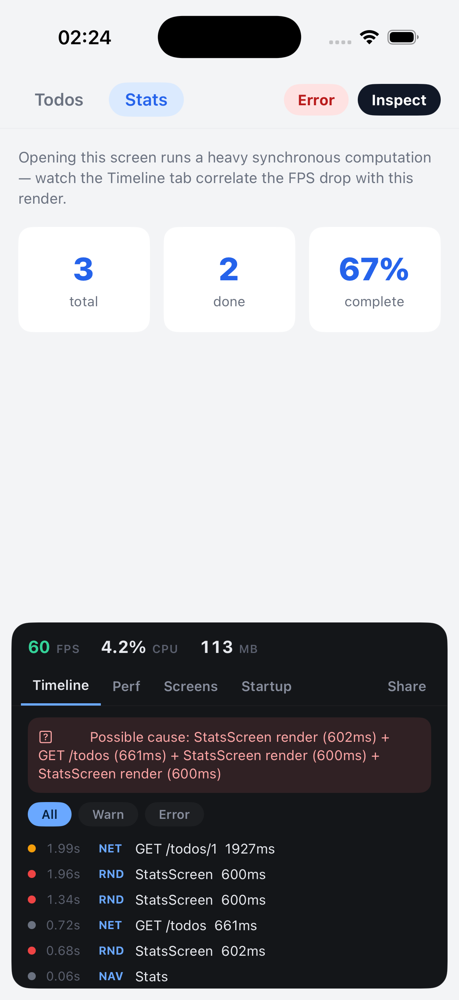
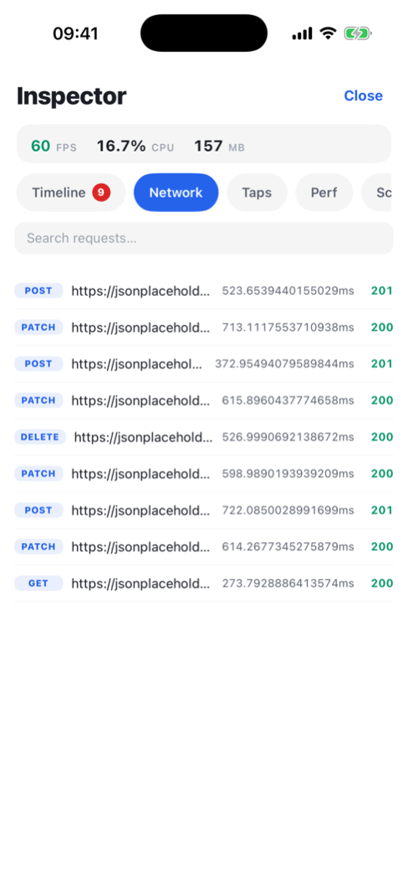
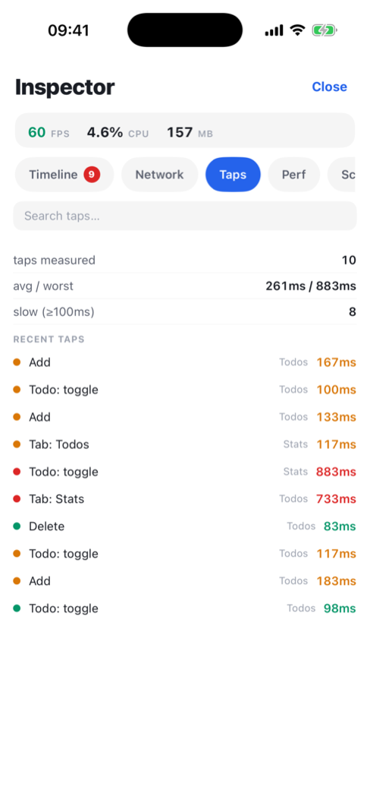
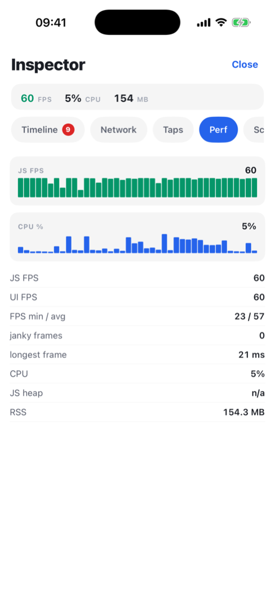
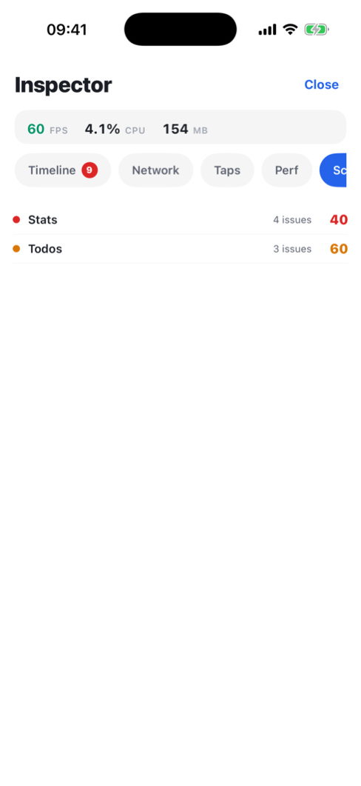
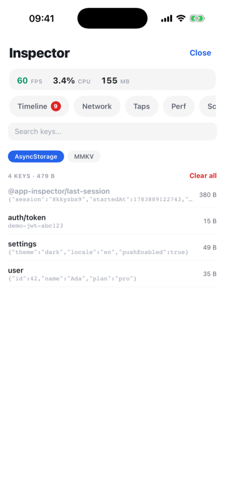

# react-native-app-inspector

[](https://github.com/phaelor/react-native-app-inspector/actions/workflows/ci.yml)
[](https://www.npmjs.com/package/react-native-app-inspector)
[](./LICENSE)

> On-device performance & debug panel for React Native — **no Metro, no USB, no
> computer.** One wrapper component, zero dependencies.

Ship it inside your QA / staging build. When a tester hits jank on a release
build three timezones away, they open the panel on the phone, see **what's slow
and why**, and share the session as JSON.

<div align="center">

</div>

## Install

```sh
npm install react-native-app-inspector
cd ios && pod install        # native FPS/CPU/RSS + network capture (optional)
```

`react` and `react-native` are the only peer deps. The native module autolinks;
without a rebuild everything still works in JS — you just lose the native
metrics.

## Quick start

```tsx
import { InspectorRoot } from 'react-native-app-inspector';

export default function Root() {
  return (
    <InspectorRoot enabled={__DEV__}>
      <App />
    </InspectorRoot>
  );
}
```

That's the whole integration. Capture starts, a draggable **FPS / CPU / MB
badge** floats over the app, and tapping it opens the panel.

## What you get

| | | |
|:---:|:---:|:---:|
| <br><sub><b>Timeline</b> — everything in one log,<br>with cause correlation</sub> | <br><sub><b>Network</b> — every request,<br>captured natively</sub> | <br><sub><b>Taps</b> — tap→response latency,<br>auto-captured</sub> |
| <br><sub><b>Perf</b> — JS/UI FPS, CPU, memory,<br>renders</sub> | <br><sub><b>Screens</b> — every screen scored<br>0–100, with its problems</sub> | <br><sub><b>Storage</b> — browse & edit<br>AsyncStorage / MMKV</sub> |

| Tab | What it shows |
|---|---|
| **Timeline** | Time-ordered log of actions, navigation, renders, network, FPS drops, memory and errors. Tap an FPS drop → **cause correlation** tells you what likely caused it. |
| **Network** | Every request with method, status, duration. Captured **natively** (NSURLProtocol / OkHttp interceptor) when the native module is installed, XHR patch otherwise. |
| **Taps** | Tap→response latency for **every pressable**, automatically — labels from `testID` / text, timing from the native touch timestamp to the next presented frame. RAIL-coded: <100 ms good, >300 ms sluggish. |
| **Perf** | Live JS & UI-thread FPS, CPU, RSS memory, JS heap, jank — plus per-component render stats (count, avg, worst). |
| **Screens** | Per-screen score **0–100** with the concrete problems: slow load, FPS drops, slow renders, memory growth, slow requests, slow taps. |
| **Storage** | Key/value browser for AsyncStorage / MMKV / anything: search, pretty-printed JSON, edit, delete, clear. |
| **Startup** | Time-to-interactive and custom marks (`AppInspector.mark('cache-ready')`). |
| **Settings** | Pause live updates, share the session (native share sheet), clear, hide the badge. |

Everything above is captured automatically — network, errors (`console.error`
/ uncaught), FPS/CPU/memory, renders, taps. You only add calls for what the
library can't see: custom actions and non-React-Navigation screen changes.

## Configuration

All props are optional:

```tsx
<InspectorRoot
  enabled={__DEV__}            // false → children render untouched, zero overhead
  navigationRef={navRef}       // React Navigation ref → automatic screen tracking
  storage={AsyncStorage}       // persist session → survives a crash/relaunch
  storages={[mmkvAdapter(kv)]} // extra stores for the Storage tab
  badge={true}                 // floating FPS badge (drag to any corner)
  badgeCorner="bottom-left"
  initialTab="timeline"
  autoCaptureTaps={true}
  profileRoot={true}           // root render profiler (id "App")
  modules={{ network: true, errors: true, performance: true, slowScreens: true }}
  maxEntries={500}             // ring-buffer size per feed
/>
```

## Recipes

<details>
<summary><b>React Navigation — automatic screen tracking</b></summary>

```tsx
const navRef = useNavigationContainerRef();

<InspectorRoot enabled={__DEV__} navigationRef={navRef}>
  <NavigationContainer ref={navRef}>{/* … */}</NavigationContainer>
</InspectorRoot>;
```

Every screen change is logged, timed and profiled. Without React Navigation,
call `AppInspector.trackNavigation('Checkout')` yourself or wrap screens in
`<InspectorScreen name="Checkout">`.
</details>

<details>
<summary><b>Storage tab — AsyncStorage, MMKV, custom stores</b></summary>

```tsx
import { asyncStorageAdapter, mmkvAdapter } from 'react-native-app-inspector';

<InspectorRoot
  storages={[asyncStorageAdapter(AsyncStorage), mmkvAdapter(new MMKV())]}>
```

Passing `storage={AsyncStorage}` alone already enables the tab for it. Any
object with `{ name, getAllKeys, get, set, remove }` works as a custom store.
</details>

<details>
<summary><b>Manual tracking — actions, Redux, network</b></summary>

```ts
AppInspector.trackAction('add_to_cart', { sku: 'A-123' });
AppInspector.trackNetwork({ method: 'POST', url: '/orders', status: 201, durationMs: 840 });

// Redux — log every dispatch:
applyMiddleware(AppInspector.getActionLogger().middleware());

// Time a custom interaction (auto tap capture handles normal presses):
const done = AppInspector.beginInteraction('Checkout');
await submitOrder();
done();
```
</details>

<details>
<summary><b>Profiling one component</b></summary>

```tsx
<InspectorProfiler id="ProductList">
  <ProductList />
</InspectorProfiler>
```

Its commit count / avg / worst render times show up under Perf → Renders.
</details>

<details>
<summary><b>Exporting a session programmatically</b></summary>

```ts
import { exportLogs, shareLogs } from 'react-native-app-inspector';

const json = exportLogs(); // full snapshot as a JSON string
await shareLogs();         // native share sheet (also in the Settings tab)
```

`AppInspector.getPreviousSession()` returns the persisted previous session
(set `storage` to enable) — including one that ended in a crash.
</details>

<details>
<summary><b>Custom UI instead of the badge</b></summary>

```tsx
<InspectorRoot badge={false} /* … */>
  <App />
</InspectorRoot>
```

Then render `<InspectorModal visible={open} onClose={…} />` from your own
trigger (shake, hidden multi-tap, dev menu). `useInspectorState()` gives you
the live state for fully custom UIs.

> Prefer rendering it **as a sibling of `InspectorRoot`** — inside the
> profiled subtree, commits containing the open panel are excluded from the
> render stats.
</details>

## Example app

[`example/`](example) is a Todo app wired for inspection — real network,
actions, renders and taps to look at:

```sh
cd example && npm install && npm run ios   # or npm run android
```

## Development

```sh
npm run typecheck && npm run lint && npm test
```

<details>
<summary>Project structure</summary>

```
src/
  core/        controller, observable store, shared types (no react-native)
  modules/     timeline, performance, screens, render, startup, network,
               actions, errors, interactions, taps, navigation, storage,
               persistence, deviceInfo
  native/      bridge to the iOS/Android native module
  ui/          badge, modal, tabs
  export/      snapshot + serialization
ios/ android/  native metrics + network capture
```
</details>

## License

MIT © [phaelor](https://github.com/phaelor)
